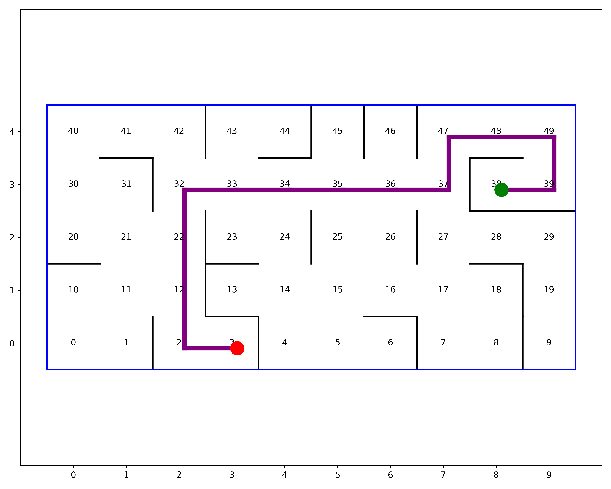

# Gépitanulás házi feladat

[](https://GitHub.com/Naereen/StrapDown.js/graphs/commit-activity)
[](https://github.com/psf/black)
[](https://pycqa.github.io/isort/)
---

## Feladat leírása

## Példa a működésre

A raraktár:


Robot a `4`-es pozícióban van és a `10` helyre kell mennie felvenni az árut:
```python
>>> r = QLRobot(ExampleWarehouse())
>>> route = r.get_route(4, 10)
>>> [4, 0, 1, 5, 9, 10]
```


```python
>>> route = r.get_route(10, 11)
>>> [10, 6, 7, 11]
```


```python
>>> route = r.get_route(3, 8)
>>> [10, 6, 7, 11]
```


## Generált raktár

```python
>>> w = RandomWarehouse(10, 5, seed=65, walls=25)
>>> r = QLRobot(w, niter=10_000)
>>> route = r.get_route(3, 38)
>>> [3, 2, 12, 22, 32, 33, 34, 35, 36, 37, 47, 48, 49, 39, 38]
```



```python
>>> w = RandomWarehouse(10, 10, seed=65, walls=50)
>>> r = QLRobot(w, niter=10_000)
>>> route = r.get_route(9, 72)
>>> [3, 2, 12, 22, 32, 33, 34, 35, 36, 37, 47, 48, 49, 39, 38]
```


