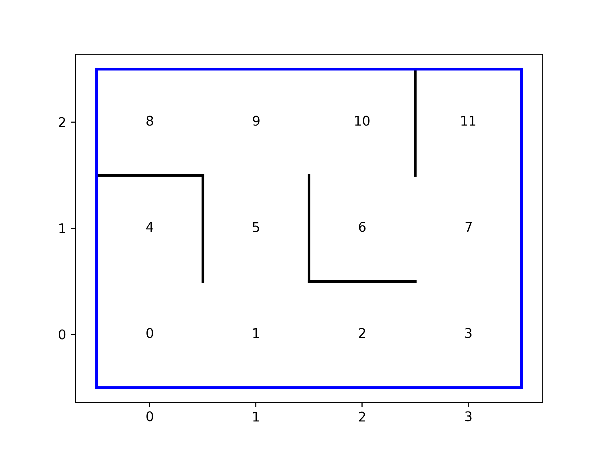

# Gépitanulás házi feladat

[](https://github.com/robust/actions)
[](https://codecov.io/gh/gkrisztian1/gepitanulas-nagyhazi)
[](https://www.gnu.org/licenses/agpl-3.0)
[](https://GitHub.com/Naereen/StrapDown.js/graphs/commit-activity)
[](https://github.com/psf/black)
[](https://pycqa.github.io/isort/)
[](https://lgtm.com/projects/g/gkrisztian1/gepitanulas-nagyhazi/alerts/)
[](https://lgtm.com/projects/g/gkrisztian1/gepitanulas-nagyhazi/context:python)

---

## Feladat leírása

## Példa a működésre

A raraktár:



Robot a `4`-es pozícióban van és a `10` helyre kell mennie felvenni az árut:
```python
>>> route = r.get_route(0, 10)
>>> [4, 0, 1, 5, 9, 10]
```


